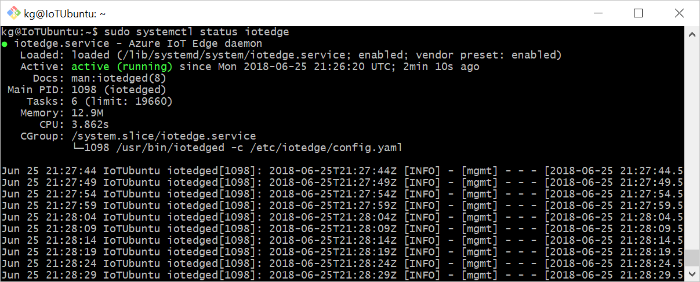

{{*We highly recommend keeping this document current, and Microsoft reserves a right to remove devices and documents from the Azure IoT Device Catalog if document contains broken URL links, incorrect information etc.*}}

Run Azure IoT Edge Runtime on {enter your device name here} device running {enter the OS name running on edge device. Specify distribution or Windows SKU information. Ex: Ubuntu Sever 16.04, Windows 10 IoT Core.}
===
---

# Table of Contents

-   [Introduction](#Introduction)
-   [Step 1: Prerequisites](#Prerequisites)
-   [Step 2: Prepare your Device](#PrepareDevice)
-   [Step 3: Manual Test for Azure IoT Edge on device](#Manual)
-   [Step 4: Additional information](#Additionalinformation)
-   [Step 5: Additional Links](#AdditionalLinks)

# Instructions for using this template

-   Replace the text in {placeholders} with correct values.
-   Delete the lines {{enclosed}} after following the instructions enclosed between them.
-   It is advisable to use external links, wherever possible.
-   Remove this section from final document.
-   Provide estimated time to complete the end-to-end operation. For better experience, we recommend to put estimated time for each section in "Prepare your device" and "Manual Test for Azure IoT Edge on device" respectively

# Introduction

**About this document**

This document describes how to connect {enter your device name here} device running {enter the OS name running on edge device} with Azure IoT Edge Runtime pre-installed and Device Management. This multi-step process includes:

-   Configuring Azure IoT Hub
-   Registering your IoT device
-   Build and Deploy client component to test device management capability 

# Step 1: Prerequisites

You should have the following items ready before beginning the process:

-   [Create an Azure account](https://azure.microsoft.com/en-us/free/)
-   [Sign up to Azure Portal](https://portal.azure.com/#home)
-   [Setup your IoT hub](https://github.com/Azure/azure-iot-device-ecosystem/blob/master/setup_iothub.md)
-   [Add the Edge Device](https://docs.microsoft.com/en-us/azure/iot-edge/quickstart-linux)
-   [Add the Edge Modules](https://docs.microsoft.com/en-us/azure/iot-edge/quickstart-linux?view=iotedge-2018-06#deploy-a-module)
-   {enter your device name here} device.

## Additional Hardware & Software Requirements
{Note: if your device does not have additional Hardware and or software requirements to connect to Azure, this section can be removed}

The {device} has an additional {[hardware | software | hardware and software]} dependency that {[is | are]} required in order to connect to Azure:
* {Add details}

{For device with HW dependency}
This device was tested with the following Azure Certified Device gateway: {add link}

{Additional details on configuring HW or SW dependencies as necessary}

# Step 2: Prepare your Device

-   {{Write down the instructions required to setup, configure and connect your device. Please use external links when possible pointing to your own page with device preparation steps.}}
-   {{Please specify if any other software(s) or hardware(s) are required.}}

# Step 3: Manual Test for Azure IoT Edge on device

This section walks you through the test to be performed on the Edge devices running the Linux operating system such that it can qualify for Azure IoT Edge certification.

## 3.1 Edge RuntimeEnabled (Mandatory)

**Details of the requirement:**

The following components come pre-installed or at the point of distribution on the device to customer(s):

-   Azure IoT Edge Security Daemon
-   Daemon configuration file
-   Moby container management system
-   A version of `hsmlib` 

*Edge Runtime Enabled:*

**Check the iotedge daemon command:** 

Open the command prompt on your IoT Edge device , confirm that the Azure IoT edge Daemon is under running state

    systemctl status iotedge

 

Open the command prompt on your IoT Edge device, confirm that the module deployed from the cloud is running on your IoT Edge device

    sudo iotedge list

  

On the device details page of the Azure, you should see the runtime modules - edgeAgent, edgeHub and tempSensor modueles are under running status

 

# Step 4: Additional information
Put any additional information here such as additional description, alternative paths etc.

# Step 5: Additional Links

-   [What is Azure IoT Edge](https://docs.microsoft.com/en-us/azure/iot-edge/about-iot-edge?view=iotedge-2018-06)
-   [Azure IoT Edge 1.0.10 release is now available](https://azure.microsoft.com/en-us/updates/iot-edge1-0-10/)
-   [Azure IoT Edge supported systems](https://docs.microsoft.com/en-us/azure/iot-edge/support?view=iotedge-2018-06)
-   [Develop your own IoT Edge modules](https://docs.microsoft.com/en-us/azure/iot-edge/module-development?view=iotedge-2018-06)
